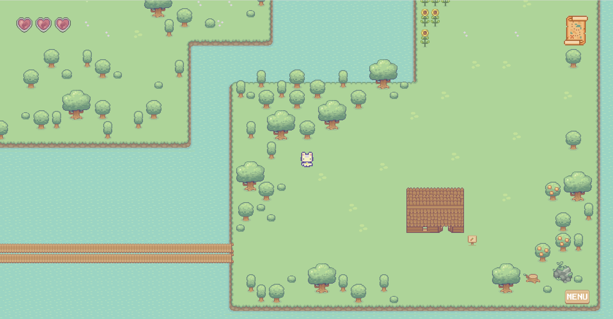
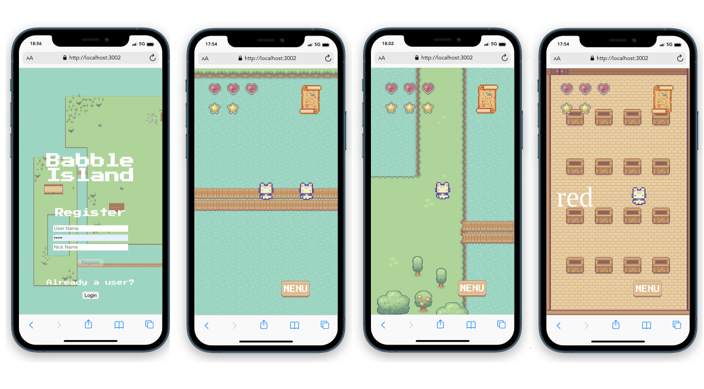

# Babble Island


Babble Island was designed as a game for kids. Set on an island in pixel art style, it allows children to start learning foreign languages in a fun way. On the island, there are various characters to talk to and different mini games that can be completed to collect stars. Different stories can be read or requested from ChatGPT based on a topic. A simultaneous translator translates words that are not understood.


## Screenshots

<p align="center">
  
  
</p>


## Getting started

1. Clone the repo

```
git clone https://github.com/MatthewKelsey/Babble-Island
cd Babble-Island
```

2. Install dependencies in both /client and /server folders
```
npm install
```

3. Start development server
```
cd /Server
nodemon index.js
```

4. Start the front end app
```
cd /client
npm start
```


## Tech Stack

* [Phaser 3](https://phaser.io/phaser3) - Desktop and Mobile HTML5 game framework
* [React](https://reactjs.org) - Front end library for building user interfaces
* [Cloudinary](https://cloudinary.com) - Image and Video APIs
* [Express JS](https://expressjs.com) - Web framework for Node.js
* [MongoDB with Mongoose](https://www.mongodb.com) - NoSQL database management system

## Developers

* Matthew Kelsey - [GitHub](https://github.com/MatthewKelsey) - [LinkedIn]()
* Luke Saunders - [GitHub](https://github.com/LukeNSaunders) - [LinkedIn]()
* Marcella Baldo - [GitHub](https://github.com/marjory23) - [LinkedIn]()
